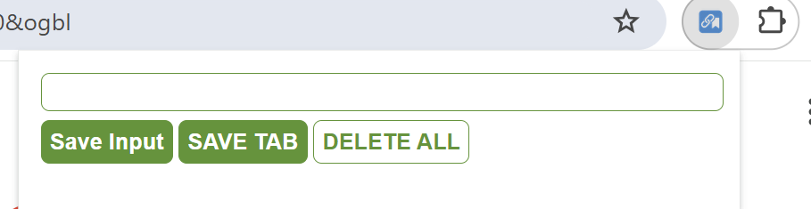

# 🧩 URLKeeper Chrome Extension

**URLKeeper** is a minimal Chrome Extension for saving and managing website URLs directly from your browser. It allows users to:

- ✍️ Manually enter a URL to save
- 🌐 Save the current browser tab's URL
- 📋 View saved links as clickable items
- ❌ Delete all saved links with double-click protection

> ⚡ Perfect for bookmarking resources, tutorials, tools, or articles with one click — no more cluttered browser bookmarks!

---

## Demo

<https://urlkeeper.netlify.app/>

⚠️ This is not the Chrome Extension version.
This demo uses a public Firebase database with no authentication.
Anyone can view, add, or delete data. Please use it for demonstration only — do not store sensitive information.

---

## 📸 Preview

---

## 📦 Features

- 🔖 Save URLs manually or from the active browser tab
- 📑 View all saved URLs in a clean list
- 🗑 Double-click `DELETE ALL` to clear your saved data
- 💾 Automatically stores data using `localStorage`
- 🔐 Works fully offline — no Firebase or server required

---

## 🔧 Technologies

| Tech         | Purpose                        |
| ------------ | ------------------------------ |
| HTML/CSS     | UI structure and styling       |
| JavaScript   | Extension logic + storage      |
| Chrome API   | Get current active tab info    |
| localStorage | Persist URLs between sessions  |
| Manifest V3  | Chrome Extension configuration |

---

## 🚀 How to Use

1. **Add the Extension Locally**

   - Clone or download this repository
   - Go to `chrome://extensions/` in Chrome
   - Enable **Developer Mode**
   - Click **Load Unpacked**
   - Select the extension folder (with `manifest.json`)

2. **Save a URL**

   - Enter a URL manually and click `Save Input`
   - Or click `SAVE TAB` to auto-save the current tab’s URL

3. **View Saved Links**

   - All links appear below in a list
   - Click any item to open it in a new tab

4. **Delete All**

   - Double-click `DELETE ALL` to clear your entire list

---

## 📜 manifest.json (Manifest V3)

```json
{
  "manifest_version": 3,
  "version": "1.0",
  "permissions": ["tabs"],
  "name": "Leads tracker",
  "action": {
    "default_popup": "index.html",
    "default_icon": "icon.png"
  }
}
```

## 🧠 Developer Notes

- All URLs are saved in localStorage under the key `myData`

- The Chrome Tabs API is used to fetch the currently active tab’s URL

- The extension works entirely offline

- localStorage.clear() is only triggered on double-click for safety

## 🛡️ Privacy

This extension:

- Stores data locally only

- Requires no login

- Has no trackers or analytics

- Requests only the minimal "tabs" permission
